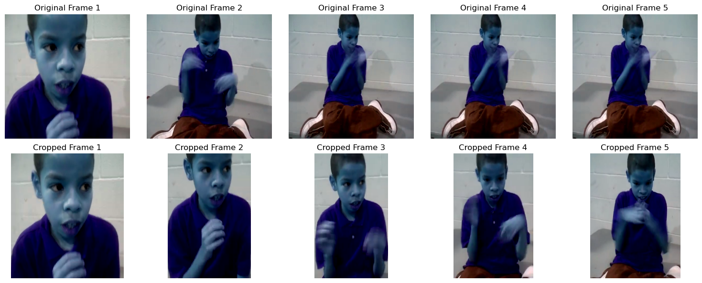
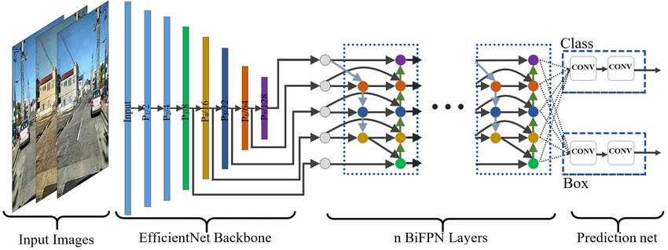
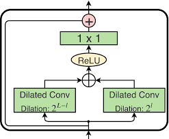
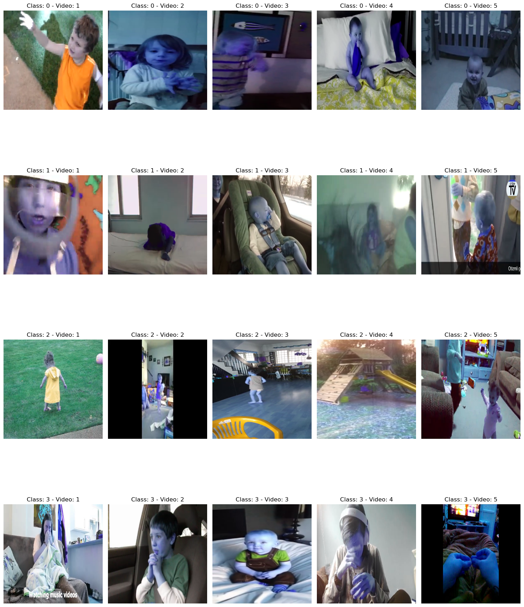
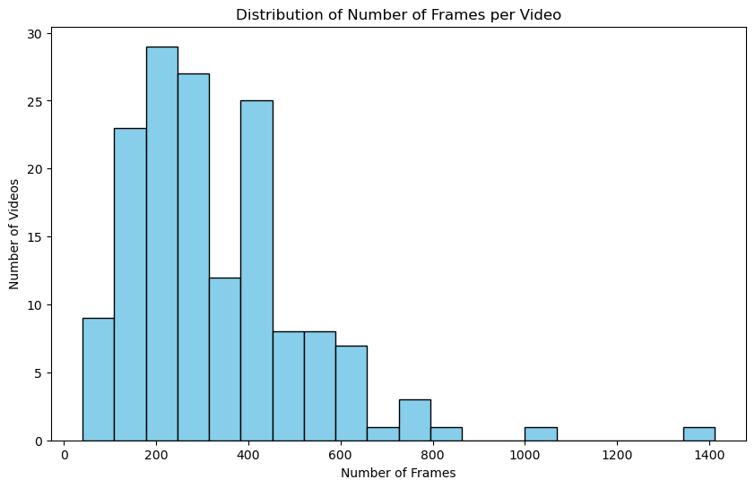
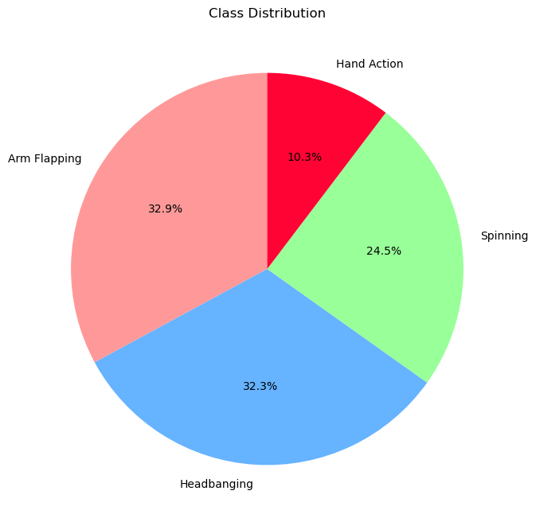

# Video Frame Analysis and Action Classification Pipeline

## Overview

This repository provides a complete framework for video analysis, with a focus on detecting individuals, specifically children, within frames and classifying their actions over time. By utilizing advanced deep learning models, such as EfficientNet and Multi-Stage Temporal Convolutional Networks (MSTCN++), this pipeline effectively processes raw video input and outputs meaningful insights about the actions occurring within each video.

The project integrates several key components, including object detection, feature extraction, and sequence modeling, allowing for an efficient and accurate workflow. It is designed to be modular, scalable, and adaptable for other action classification tasks or domains beyond the current scope.

## Key Definitions and Concepts

### 1. **Video Frame Extraction**
   - **Definition**: Video frame extraction is the process of breaking down a video file into its individual frames. Frames are still images that, when played in sequence, represent the motion in a video.
   - **Purpose**: In this pipeline, frames are extracted to allow for focused analysis of individual segments of the video, facilitating more efficient feature extraction and detection processes.

     
   *Figure 1: Sample frames extracted from a video.*

### 2. **Object Detection with Detectron2**
   - **Definition**: Object detection is a computer vision technique used to locate and classify objects within an image or video frame. Detectron2 is a state-of-the-art framework developed by Facebook AI Research (FAIR) for object detection and segmentation tasks.
   - **Purpose**: Detectron2 is used in this pipeline to detect and isolate children from other objects or individuals within video frames, ensuring that the analysis focuses on the relevant subjects.

     
   *Figure 2: Object detection results highlighting detected children within a frame.*

### 3. **Child Cropping**
   - **Definition**: Cropping refers to the process of removing or cutting out parts of an image or frame to focus on a specific region of interest. In this context, it means isolating the detected children in each frame.
   - **Purpose**: Cropping allows the model to focus solely on the detected child, which improves the accuracy of subsequent feature extraction and action classification tasks.

     
   *Figure 3: Comparison between original frame and cropped frame focusing on the detected child.*

### 4. **Feature Extraction with EfficientNet**
   - **Definition**: Feature extraction is the process of converting raw input data (in this case, video frames) into numerical representations that a model can use for prediction. EfficientNet is a highly efficient convolutional neural network (CNN) architecture that balances accuracy and computational efficiency.
   - **Purpose**: EfficientNet extracts rich, high-level features from the cropped video frames, which serve as the input for temporal action classification. Its efficient architecture ensures that feature extraction can be performed without excessive computational overhead.

     
   *Figure 4: Visual representation of features extracted from a cropped frame using EfficientNet.*

### 5. **Temporal Modeling with MSTCN++**
   - **Definition**: Temporal modeling involves analyzing sequences of data to understand how they evolve over time. Multi-Stage Temporal Convolutional Network (MSTCN++) is a neural network architecture designed to process temporal sequences of data, particularly for tasks involving time-series analysis.
   - **Purpose**: MSTCN++ is used in this pipeline to model the temporal dynamics of actions within video sequences. By taking the features extracted from individual frames, MSTCN++ learns to recognize and classify the actions over time, providing meaningful predictions about the activities in the video.

     
   *Figure 5: Temporal model's structure showing the progression of action classification over time.*

### 6. **Action Classification**
   - **Definition**: Action classification refers to identifying the specific activity or action taking place in a video or image sequence. This could include actions such as walking, jumping, or playing.
   - **Purpose**: The primary goal of the pipeline is to classify the actions of detected children in each video, providing insights into the activities they are engaged in, based on the temporal sequence of extracted features.

     
   *Figure 6: Visual video frames classified by action.*

## Visualizations

### 1. **Original vs Cropped Comparison**
   This visualization shows the comparison between the original video frames and the cropped frames that focus on the detected child.
   
     
   *Figure 7: Comparison of original vs cropped video frames.*

### 2. **Frame Distribution per Action**
   This bar chart displays the number of frames classified for each action, providing an overview of the action distribution within the video dataset.
   
     
   *Figure 8: Bar chart showing the number of frames in each action category.*

### 3. **Action Distribution Pie Chart**
   A pie chart that visualizes the proportion of each action category detected in the entire dataset.
   
     
   *Figure 9: Pie chart representing the distribution of different actions.*

## Project Structure

The pipeline consists of the following components:

1. **Video to Frame Conversion**: Breaks down video files into frames to be processed.
2. **Child Detection and Cropping**: Detects children in the frames using Detectron2 and crops the frames to focus on them.
3. **Feature Extraction**: Utilizes EfficientNet to extract high-level features from the cropped frames.
4. **Action Classification**: Uses MSTCN++ to model the temporal sequence of frames and classify actions over time.

## Use Cases

This pipeline can be adapted for various applications, including but not limited to:
- Monitoring child activities in educational or recreational environments.
- Classifying actions in sports videos.
- Human behavior analysis in surveillance footage.

## Conclusion

This repository provides a well-structured pipeline for detecting and classifying actions in videos. By leveraging modern deep learning techniques, the pipeline is efficient and capable of producing high-quality predictions. It is designed to be flexible and can be adapted to other object detection and action classification tasks with minimal modifications.
